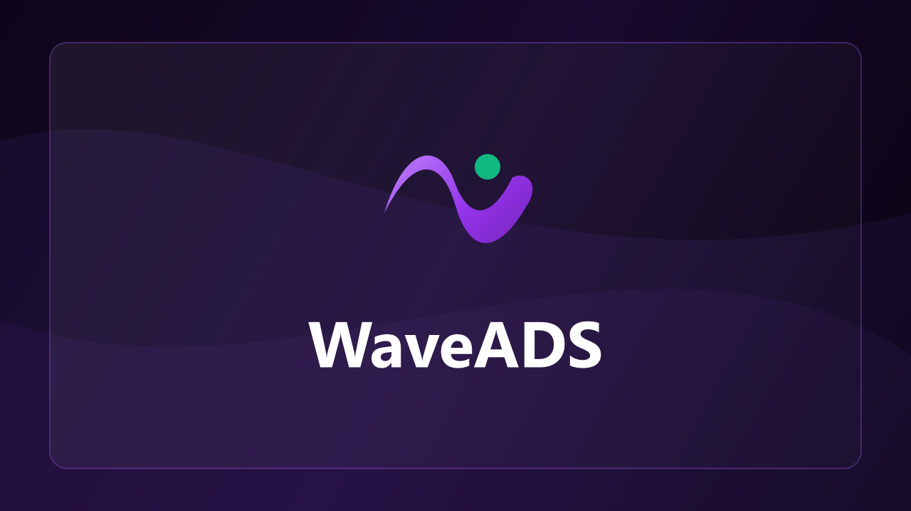
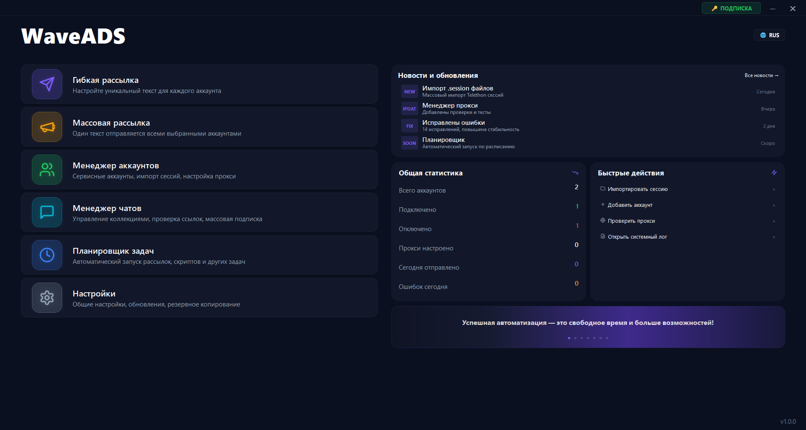
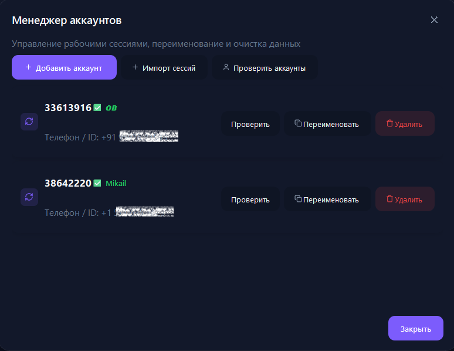
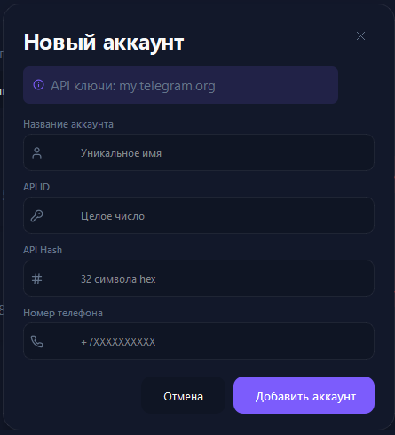
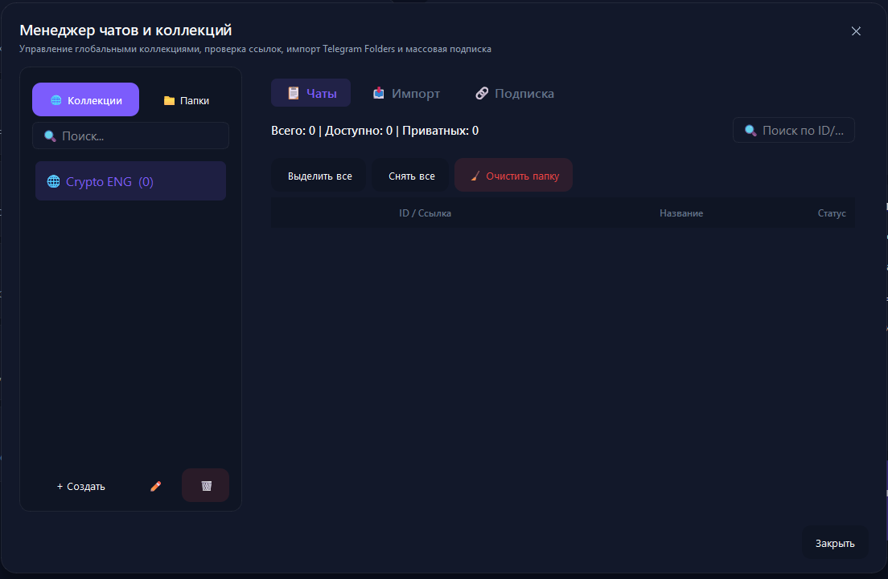
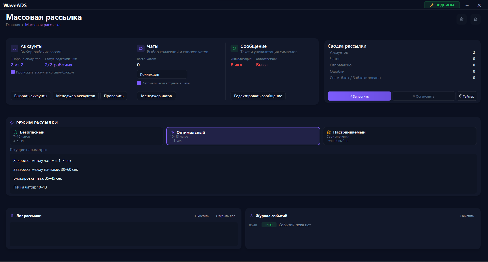
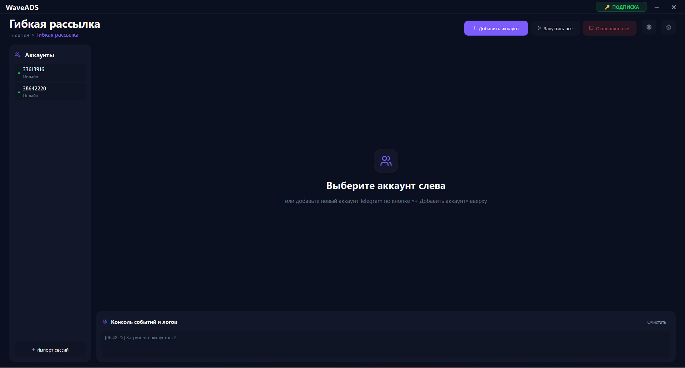
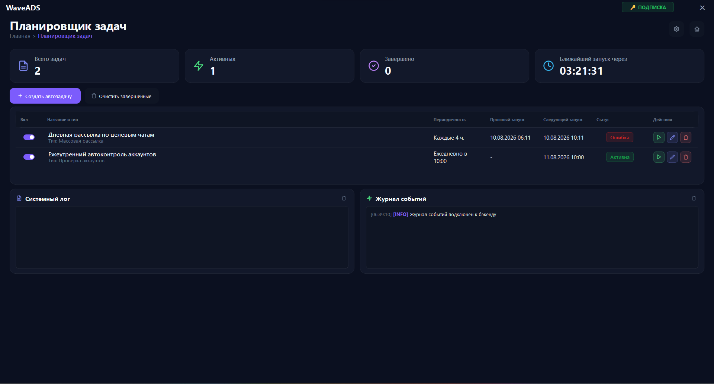
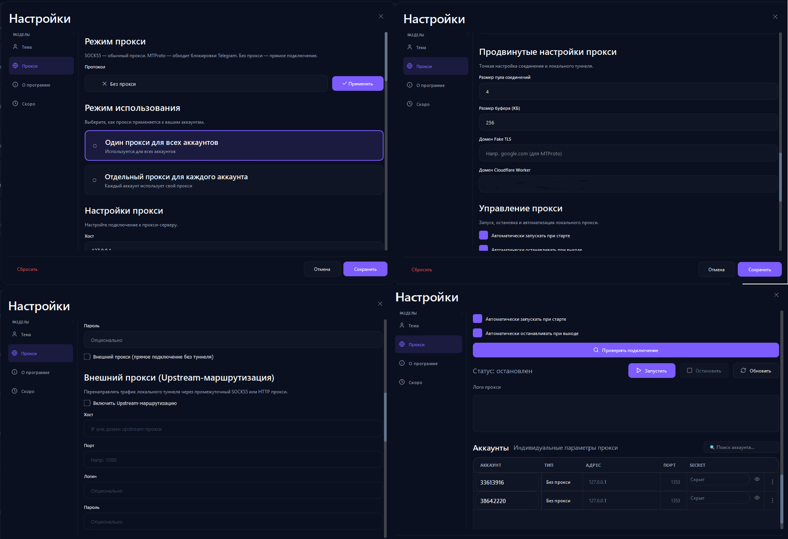

# 🚀 WaveADS 1.0 — Полное руководство пользователя

Добро пожаловать в официальное руководство по использованию **WaveADS 1.0** — профессионального программного комплекса для автоматизации продвижения, массовых и гибких рассылок в Telegram.

---

## 📋 Содержание

1. [⭐ Обзор и возможности](#-обзор-и-возможности)
2. [⚙️ Подготовка и Быстрый старт](#️-подготовка-и-быстрый-старт)
   - [Системные требования](#системные-требования)
   - [Активация лицензии](#активация-лицензии)
   - [Первый запуск](#первый-запуск)
3. [👥 Управление аккаунтами (Account Manager)](#-управление-аккаунтами-account-manager)
   - [Добавление по номеру и API ID / Hash](#добавление-по-номеру-и-api-id--hash)
   - [Импорт готовых .session файлов](#импорт-готовых-session-файлов)
   - [Авторизация: Ввод кода СМС и 2FA](#авторизация-ввод-кода-смс-и-2fa)
   - [Проверка статуса и Спамблока (@SpamBot)](#проверка-статуса-и-спамблока-spambot)
4. [📁 Менеджер чатов и папок (Chat Manager)](#-менеджер-чатов-и-папок-chat-manager)
   - [Создание папок чатов](#создание-папок-чатов)
   - [Поддерживаемые форматы ссылок](#поддерживаемые-форматы-ссылок)
   - [Массовое авто-вступление в группы](#массовое-авто-вступление-в-группы)
5. [📢 Режимы рассылки](#-режимы-рассылки)
   - [🚀 Массовая рассылка (Mass Mailing)](#-массовая-рассылка-mass-mailing)
   - [🎛️ Гибкая рассылка (Flexible Mailing)](#️-гибкая-рассылка-flexible-mailing)
   - [🎯 Умные Упоминания 70/30 (Smart Mentions)](#-умные-упоминания-7030-smart-mentions)
   - [🤖 Автоответчик (Autoresponder)](#-автоответчик-autoresponder)
6. [⚡ Планировщик задач (Scheduler)](#-планировщик-задач-scheduler)
   - [Настройка автозадач по расписанию](#настройка-автозадач-по-расписанию)
   - [Контроль оффлайн-пропусков](#контроль-оффлайн-пропусков)
7. [🛡️ Настройки прокси и антибана](#️-настройки-прокси-и-антибана)
   - [Режимы работы (Без прокси, SOCKS5, MTProto)](#режимы-работы-без-прокси-socks5-mtproto)
   - [WSS Proxy & Cloudflare Worker](#wss-proxy--cloudflare-worker)
8. [🔄 Сброс HWID и смена ПК](#-сброс-hwid-и-смена-пк)
9. [❓ FAQ и Решение проблем](#-faq-и-решение-проблем)

---

## ⭐ Обзор и возможности

**WaveADS 1.0** разработан на высокопроизводительном C++/Python стеке с графическим интерфейсом SaaS Linear 2026 и поддержкой полного цикла продвижения в Telegram.

### Ключевые преимущества:
- **Высокая скорость и параллельность**: Одновременная работа десятков аккаунтов без подвисаний интерфейса.
- **Два мощных режима рассылки**:
  - *Массовая рассылка*: ротация аккаунтов, распределение базы чатов по кругу, встроенный контроль задержек.
  - *Гибкая рассылка*: индивидуальная настройка каждого аккаунта, отдельное сообщение и папка чатов для каждой сессии.
- **🎯 Умные Упоминания 70/30 (Smart Mentions)**: Инновационный механизм тегирования 70% самых активных спикеров чата + 30% участников. Принудительно заставляет Telegram выводить Push-уведомление в шторку смартфона целевым юзерам. Через 2 секунды после отправки теги автоматически удаляются, оставляя текст чистым!
- **Встроенный Автоответчик**: Автоматические ответы на входящие личные сообщения клиентов во время рассылки.
- **Авторизация в 1 клик**: Ввод кода СМС и облачного пароля (2FA) прямо в графическом окне приложения без использования консоли.
- **Менеджер прокси**: Поддержка SOCKS5, HTTP, MTProto и уникального встроенного модуля **Telegram WSS Proxy** с Cloudflare Worker для обхода сетевых блокировок.
- **Защита аккаунтов**: Автоматическая проверка аккаунта через `@SpamBot` перед стартом рассылки и прерывание работы при обнаружении вечного или временного спамблока.
- **🔄 Свобода смены ПК**: Возможность сбросить привязку HWID самостоятельно через бота `@WaweADS_bot` в 1 клик.

---

## ⚙️ Подготовка и Быстрый старт

### Системные требования
- **ОС**: Windows 10 / 11 (64-bit).
- **Интернет**: Стабильное подключение (от 10 Мбит/с).
- **Права**: Запуск от имени администратора (для корректной работы сетевых компонентов).

### Активация лицензии
1. Откройте Telegram и перейдите в официальный бот лицензирования **[@WaweADS_bot](https://t.me/WaweADS_bot)**.
2. Получите ваш персональный лицензионный ключ или активируйте бесплатный пробный период (24 часа).
3. При первом запуске **WaveADS.exe** введите ваш токен/ключ в окне активации.

---

## 👥 Управление аккаунтами (Account Manager)

Модуль **Менеджер аккаунтов** позволяет централизованно хранить, проверять и подключать Telegram-сессии.

### Добавление по номеру и API ID / Hash
1. Нажмите кнопку **«+ Добавить аккаунт»**.
2. Введите уникальное имя аккаунта (например, `Рабочий_1`).
3. Укажите `API ID` и `API Hash` (получить можно на my.telegram.org).
4. Укажите номер телефона в международном формате (`+7XXXXXXXXXX`).
5. Нажмите **«Добавить аккаунт»**.

### Импорт готовых .session файлов
1. Нажмите **«Импорт сессий»**.
2. Перетащите файлы `.session` в зону загрузки (Drag & Drop) или выберите их через проводник.
3. Нажмите **«Импортировать»** — аккаунты автоматически добавятся в систему.

### Авторизация: Ввод кода СМС и 2FA
> ✨ **Интерактивная авторизация**: После добавления аккаунта приложение автоматически подключается к Telegram и запрашивает код.

- На карточке аккаунта появляется поле ввода: **«Ожидание кода...»**.
- Введите полученный код из СМС или приложения Telegram и нажмите **Enter** (или кнопку **OK**).
- Если на аккаунте включён 2FA (Облачный пароль), появится поле ввода пароля. Введите пароль и подтвердите.
- После успешного входа статус сменится на `✅ ИмяАккаунта (онлайн)`.

### Проверка статуса и Спамблока (@SpamBot)
- Кнопка **«Проверить аккаунты»** запускает массовую диагностику сессий.
- Приложение подвязывается к `@SpamBot` и автоматически выявляет аккаунты с ограничениями (SpamBlock / Ban), подсвечивая их красным статусом.

---

## 📁 Менеджер чатов и папок (Chat Manager)

Окно **Менеджера чатов** предназначено для структурирования вашей базы целевых групп.

### Создание папок чатов
1. Нажмите **«+ Создать папку»** (например, `Недвижимость`, `Крипта`, `Услуги`).
2. Вставьте список ссылок на группы (по одной на строку).
3. Нажмите **«Сохранить»**.

### Поддерживаемые форматы ссылок
WaveADS поддерживает любые типы Telegram-групп:
- Публичные юзернеймы: `@group_name` или `group_name`
- Прямые web-ссылки: `https://t.me/group_name`
- Приватные ссылки-приглашения: `https://t.me/+AbCdEfGhIjK...` или `https://t.me/joinchat/...`
- Внутренние ID приватных групп: `https://t.me/c/1002423024912/123` или `-1002423024912`

### Массовое авто-вступление в группы
Если вы используете приватные группы или новые аккаунты, воспользуйтесь кнопкой **«Авто-вступление»**:
- Выберите аккаунты и папку чатов.
- Приложение автоматически вступит во все приватные и публичные группы из списка с безопасной задержкой.

---

## 📢 Режимы рассылки

### 🚀 Массовая рассылка (Mass Mailing)
Оптимальный режим для быстрых и масштабных рекламных кампаний с участием множества аккаунтов.

1. Перейдите в раздел **«Массовая рассылка»**.
2. **Выбор аккаунтов**: Отметьте галочками аккаунты, которые будут участвовать в рассылке.
3. **Папка чатов**: Выберите целевую папку с группами.
4. **Текст сообщения**: Введите рекламный текст.
5. **Задержка и скорость**: Укажите паузу между сообщениями (рекомендуется от 15–30 секунд) и паузу между кругами.
6. Нажмите **«▶ Запустить рассылку»**.

#### Рандомизация текста и синонимы:
Для предотвращения фильтрации алгоритмами Telegram используйте рандомизацию синонимов вида:
`{Привет|Здравствуйте|Добрый день}, предлагаем {качественные услуги|профессиональный софт|отличные решения}!`

### 🎛️ Гибкая рассылка (Flexible Mailing)
Режим персонального управления, где для каждого аккаунта можно задать собственные настройки.

1. Перейдите в раздел **«Гибкая рассылка»**.
2. В левой боковой панели выберите нужный аккаунт.
3. В центре экрана настройте:
   - Индивидуальную папку чатов.
   - Свой текст сообщения.
   - Персональную задержку.
4. Нажмите **«▶ Запустить»** на карточке выбранного аккаунта (или **«Запустить все»** на верхней панели).

### 🎯 Умные Упоминания 70/30 (Smart Mentions)
В режимах Массовой и Гибкой рассылки доступен тумблер **«Упоминания»**:
- **Принцип работы**: При отправке поста софт парсит историю чата и выбирает **70% самых активных участников** (тех, кто писал сообщения за последние дни) и **30% обычных участников**.
- **Push-уведомление**: Каждому из них принудительно прилетает Push-уведомление в шторку смартфона со ссылкой на пост.
- **Авто-очистка за 2 сек.**: Через 1.5–3 секунды после отправки софт удаляет из сообщения блок тегов. В итоге рекламный пост остается чистым и красивым, а целевая аудитория уже получила уведомление!

### 🤖 Автоответчик (Autoresponder)
В режиме **Гибкой рассылки** доступен модуль Автоответчика:
- Включите тумблер **«Автоответчик»** в настройках аккаунта.
- Укажите приветственный текст.
- Когда лид напишет вам в ЛС в ответ на рассылку, софт автоматически отправит ему заданное сообщение.

---

## ⚡ Планировщик задач (Scheduler)

Планировщик позволяет полностью автоматизировать работу софта 24/7.

### Настройка автозадач по расписанию
1. Перейдите в раздел **«Планировщик»**.
2. Нажмите **«+ Создать задачу»**.
3. Укажите название задачи.
4. Выберите тип: **Массовая** или **Гибкая рассылка**.
5. Установите время запуска (например, `Каждый день в 09:00` или `Каждые 4 часа`).
6. Нажмите **«Сохранить задачу»** и включите тумблер активности.

### Контроль оффлайн-пропусков
Если ПК был выключен во время запланированного запуска, при включении приложения WaveADS автоматически пересчитает следующий актуальный интервал и продолжит работу без сбоев.

---

## 🛡️ Настройки прокси и антибана

### Режимы работы
Перейдите в **Настройки → Прокси**:

- **Без прокси (по умолчанию)**: Прямое подключение к серверам Telegram. Подходит для работы с 1–3 личными аккаунтами.
- **SOCKS5 / HTTP**: Классические прокси для распределения IP-адресов между аккаунтами.
- **MTProto**: Специализированный протокол Telegram для обхода сетевых ограничений.

### WSS Proxy & Cloudflare Worker
Уникальная технология WaveADS для работы в сетях с жесткой цензурой или блокировками Telegram:
- Включает встроенный WSS-сервер.
- Поддерживает бесплатное проксирование через Cloudflare Worker.
- Позволяет подключать аккаунты даже там, где обычные IP-адреса Telegram заблокированы провайдером.

---

## 🔄 Сброс HWID и смена ПК

Если вы сменили компьютер или переустановили систему:
1. Зайдите в официальный бот **[@WaweADS_bot](https://t.me/WaweADS_bot)**.
2. Нажмите **«🔍 Мои лицензии»**.
3. Нажмите кнопку **«🔄 Сменить ПК (Сбросить HWID)»** (доступно 1 раз в 14 дней).
4. Откройте софт на новом компьютере, введите ваш токен — лицензия автоматически привяжется к новому HWID!

---

## ❓ FAQ и Решение проблем

#### Q: Софт пишет «Таймаут сети (12 сек)» при подключении аккаунта
> **Ответ**: Проверьте ваше интернет-соединение. Если вы находитесь в регионе с ограничениями доступа к Telegram, включите прокси в настройках приложения или подключите VPN.

#### Q: Статус аккаунта сменился на «SpamBlock»
> **Ответ**: Telegram временно ограничил отправку сообщений незнакомым пользователям или в публичные группы. Зайдите в официальный бот `@SpamBot` в Telegram, чтобы узнать точное время окончания ограничения.

#### Q: Как предотвратить баны аккаунтов?
> 1. Используйте прогретые аккаунты с отлёжкой.
> 2. Ставьте адекватные задержки между сообщениями (от 20–40 секунд).
> 3. Использовать рандомизацию текста `{слово1|слово2}`.
> 4. Не рассылайте прямые ссылки на сторонние сайты в первых сообщениях (лучше указывать контакты Telegram или юзернейм канала).

---

© 2026 **WaveADS Team**. Все права защищены.
